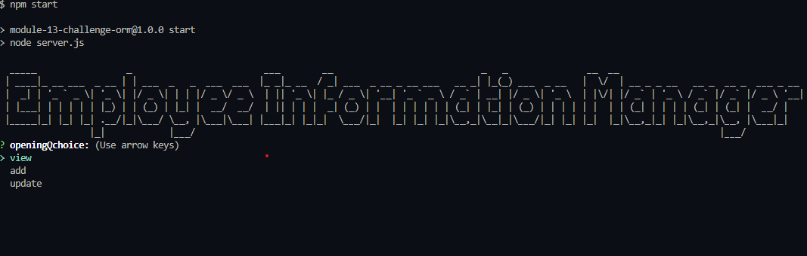
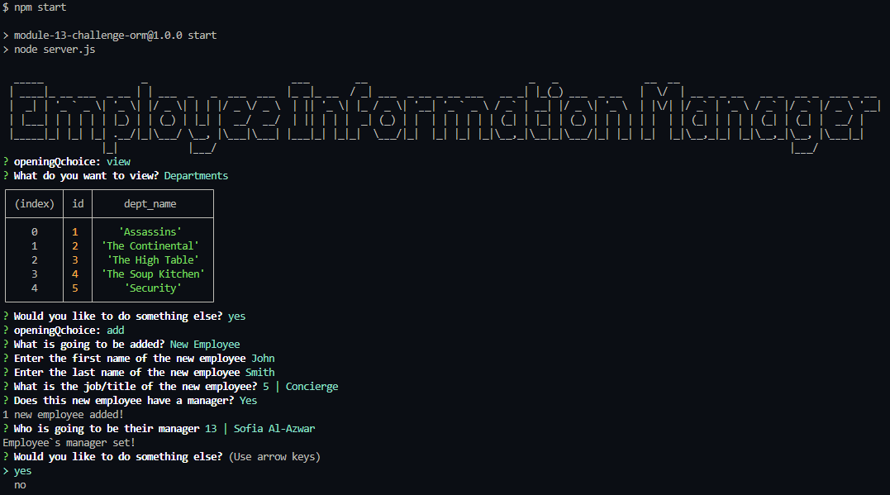

# Employee-Information-Manager

## About

This app allows the viewing and managing of employee, department and roles within a database. Specifically, it can be used to add or modify employess as well as adding additional departments or roles.
Finally, the app allows the conveniently organized viewing of existing employees, departments and roles. 
The app is run from the terminal and is intuitive and succinct.

## Installation

Please download the app at https://github.com/Famesmyname/Employee-Information-Manager

After downloading the app, run the terminal.
Run npm init & npm install to install the required dependencies.
Run the schema.sql file in the 'db' folder to generate the database and tables required.
Following the format of the schema please add your department, role, and employee information or use the provided seed data to start.
Note that this app can also be used from scratch with no employee, roles, or departments information existing.

## Usage

Start the app in the terminal with npm start or node server.js.

Please visit https://youtu.be/2qS5xg1AYFQ for a video demonstration on the functionality of the app.

Below is a screenshot of the first screen once the app is started.

When first promted you can choose to:
- View all employees,roles, or departments.
- Add and employee, role or department
- Update an existing employee's role.
As seen in the screenshot below.

## Credits
- The John Wick movie series for inspiration on the example tables used in the instructional video.

## Version History

1.00    -Released First Version

1.01    - Fixed the display table to show employee data, including employee ids, first names, last names, job titles, departments, salaries, and managers that the  employees report to when viewing employee